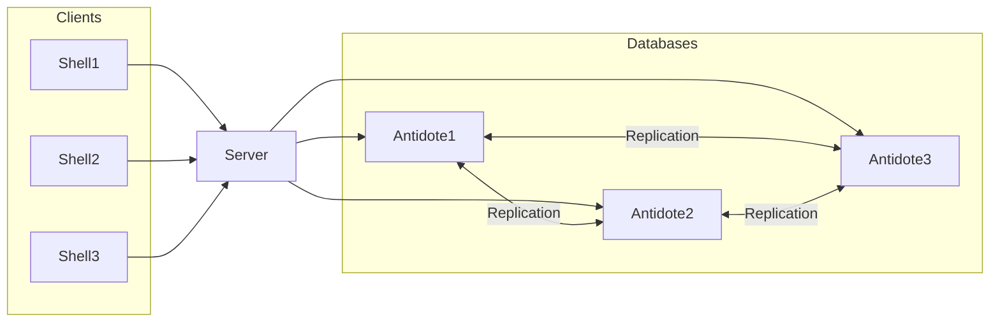

# TP CRDTs : réalisation d'un Scrum Task Board _via_ AntidoteDB 

L'objectif de ce TP est de vous familiariser avec une solution basée sur les CRDTs ([Conflict-free Replicated Data Types](https://hal.inria.fr/inria-00609399v1/document)) à travers le développement d'une applicaton de gestion de tâches. 
Cette application se présentera sous la forme d'une application Web permettant de visualiser et modifier des tâches à travers un 'Scrum Board'.


Pour réaliser cette application, vous réaliserez dans un premier temps le tutoriel 'AntidoteDB' qui vous permettra de mettre en place l'environnement nécessaire au développement de l'application


# 1. Mise en place des instances d'AntidoteDB

Ce tutoriel vous permettra de mettre en place des instances de bases [AntidoteDB](https://www.antidotedb.eu/) _via_ une de ses API, en l'occurence l'API Javascript. 

Nous souhaitons déployer la configuration illustrée comme suit :



## 1.1 Prérequis
Ce tutoriel nécessite en prérequis l'installation de :

* [Docker](https://docs.docker.com/engine/installation/)
* [docker-compose](https://docs.docker.com/compose/install/)
* [node.js][nodejs], [npm][npm], [Antidote](https://antidotedb.gitbook.io/documentation/quickstart).

et la récupération du projet :

`git clone https://forge.univ-lyon1.fr/ens-tiw8/tp-crdts-antidotedb.git`


### 1.2 Configuration
A la racine du projet, lancer sa construction : `make` (or `npm install`).  

Le lancement d'un cluster local de _Docker containers_: `make run`.  

Pour pouvoir lancer le déploiement en local d'AntidoteDB, modifiez le fichier docker/docker-antidote.yml` pour déclarer une troisième instance de base _AntidoteDB_.

Modifier le fichier de configuration d'AntidoteDB (`./config.js`) pour déclarer cette troisième instance.

Une fois les fichiers modifiés, lancer le déploiement  _via_ la commande `docker-compose -f docker/docker-antidote.yml up`.

Lancer ensuite le serveur Web _via_ la commande `DEBUG=antidote-web-shell:* npm start`.
Si tout s'est bien passé, vous devrier avoir l'affichage suivant à l'adresse  `localhost:3000`:

  


### 1.3 Test


#### Test de la synchronisation après mise à jour
 
Afin de tester la configuration que vous venez de déployer, vous avez la possibilité d'utiliser des primitives déjà implémentées qui vont vous permettre :
 
 - d'afficher un compteur, de l'incrémenter ou de le décrémmenter,
 
 ```
 counter:
    count inc <counter_id>
    count dec <counter_id>
    count get <counter_id> 
```
 
 - d'afficher une liste d'éléments, d'ajouter ou de retirer un élement de la liste.
 
```
add-wins set:
    set add <set_id> <value>
    set remove <set_id> <value>
    set get <set_id>
``` 

Tester ces primitives tout en observant le processus de synchronisation (Pour un ajout ou un incrément, faire des 'get' sur les 3 instances).

#### Test de la synchronisation après déconnexion

Pour finir, il vous reste à observer ce qui se passe quand un noeud se déconnecte, que des mises à jour entre les autres noeuds se produisent pendant cette déconnexion, et comment la synchronisation se fait au retour (reconnexion) du noeud. 

Pour simuler des déconnexions, vous allez réaliser des partitions du réseau (en cliquant sur "Create partition") et pour simuler des reconnexions, vous allez lancer la fusion des CRDTs (en cliquant sur "Heal partition"). 


# 2. Réalisation du Scrum Board

Maintenant que vous maîtrisez AntidoteDB, vous allez vous attaquer à la couche applicative qui vous permettra de gérer un Scrum Board déployé sur 3 instances d'AntidoteDB.

**Au niveau métier**, une tâche contient :

- **un titre** que l'on supposera unique dans la liste des tâches,
- **Une brève description** que l'on supposera de moins de 120 caractères,
- **Un niveau de priorité** : 'low', 'medium', 'high',
- **Une deadline** (cf [https://developer.mozilla.org/en-US/docs/Web/JavaScript/Reference/Global_Objects/Date](https://developer.mozilla.org/en-US/docs/Web/JavaScript/Reference/Global_Objects/Date),
- **Un statut** :'todo', 'doing', 'done',
- **Un utilisateur en charge de la tâche** que l'on supposera être une chaine de caractères contenant le nom et le prénom de l'utilisateur.

Servez-vous du code fourni comme point de départ dans les fichiers [server file](app.js) et [client file](public/js/script-tasks.js) pour implémenter les fonctionnalités suivantes:

* Ajouter une nouvelle commande `tasks add` qui prend un titre de tâche (qui est supposé unique), description de tâche, un niveau de priorité ('low', 'medium', 'high'), une deadline, un statut et un utilisateur comme argument et crée une nouvelle tâche dans la base,
* Ajouter une nouvelle commande `tasks get` qui prend un titre de tâche en argument et qui affiche les informations sur la tâche,
* Ajouter une nouvelle commande `tasks remove` qui prend un titre de tâche en argument et qui supprime la tâche de la base,
* Ajouter une nouvelle commande `tasks list` qui affiche toutes les tâches,
* Ajouter une nouvelle commande `tasks assign` qui prend un titre de tâche et un nom/prénom d'utilisateur en argument et qui met à jour la tâche en base,
* Ajouter une nouvelle commande `tasks status` qui prend un titre de tâche et un statut ('todo', 'doing', 'done') comme arguement et qui met la tâche à jour en base.

L'application est accessible ici : [http://localhost:3000/tasks](http://localhost:3000/tasks)

**Au niveau de l'interface graphique**
* Afficher les listes de tâches sur l'interface _via_ la fonction `renderList` (en ayant pensé à supprimer le code exemple).
* Implémenter toutes les fonctionnalités pour une visualisation et un usage graphique du _scrum board_.

### Resources utiles:
* [API](API.md)
* [Antidote API ts](https://antidotedb.github.io/antidote_ts_client/)
* [AntidoteDB source code](https://github.com/AntidoteDB/antidote)
* [AntidoteDB Documentation](https://antidotedb.gitbook.io/documentation/)
* [Antidote Docker reference](https://github.com/AntidoteDB/docker-antidote/blob/master/README.md)

## Credits

[RainbowFS][rainbowfs] and [LightKone][lightkone] research projects.

 [antidote]: https://www.antidotedb.eu/
 [rainbowfs]: http://rainbowfs.lip6.fr/
 [lightkone]: https://www.lightkone.eu/
 [nodejs]: https://nodejs.org/
 [npm]: https://www.npmjs.com/
 [antidote-setup]: https://antidotedb.gitbook.io/documentation/overview/installation

